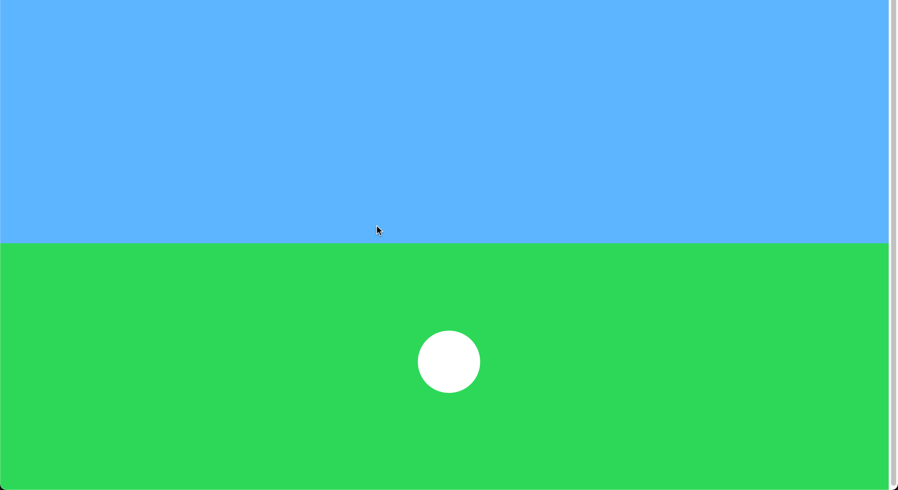
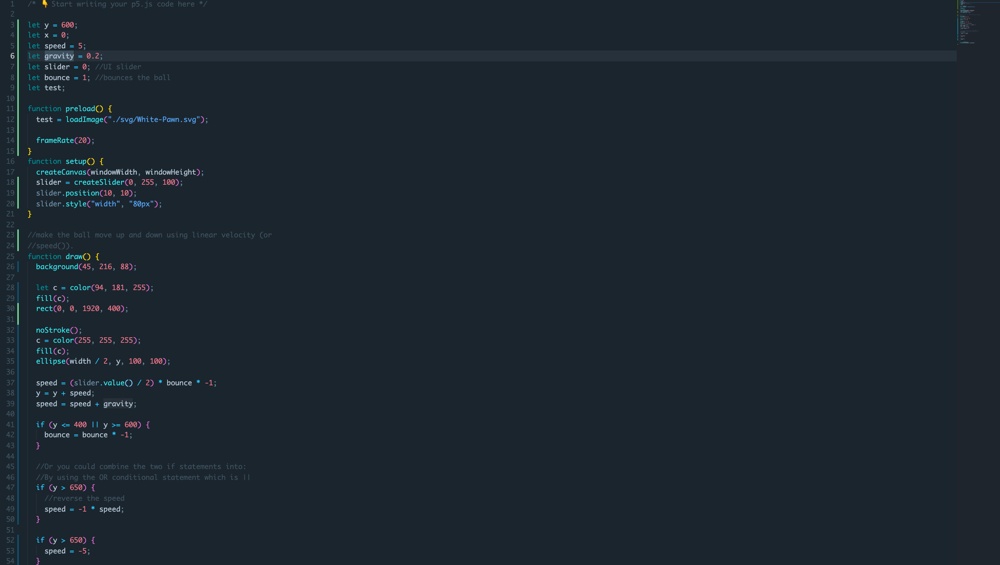
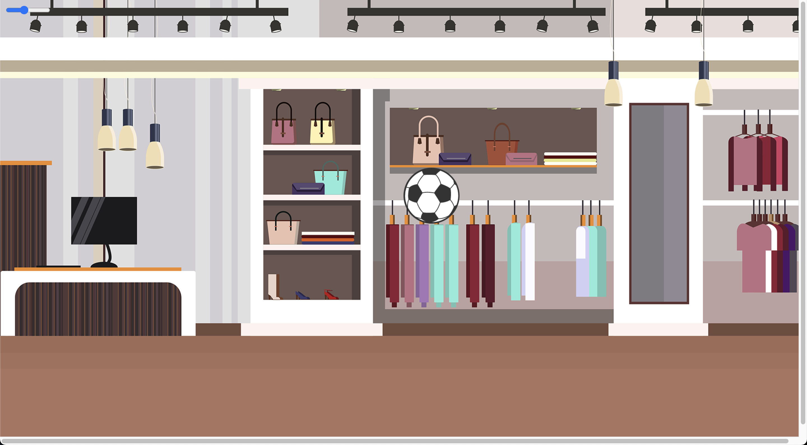
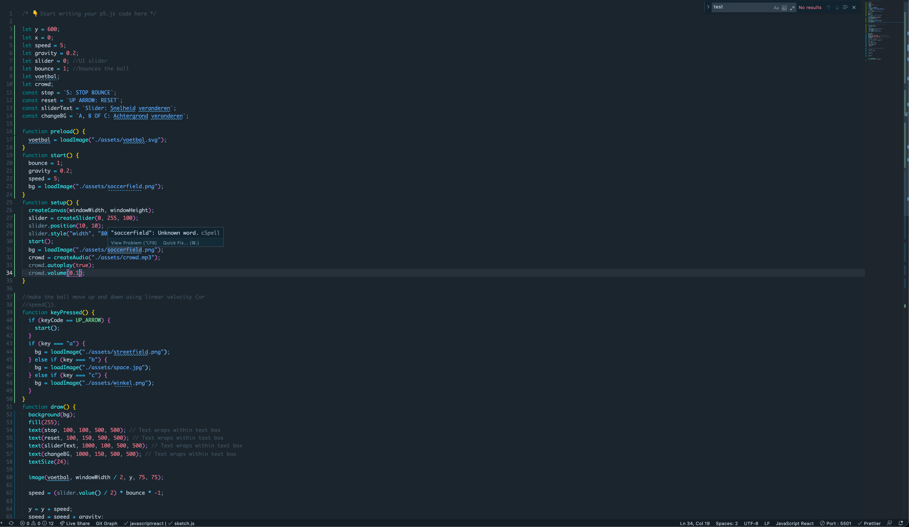
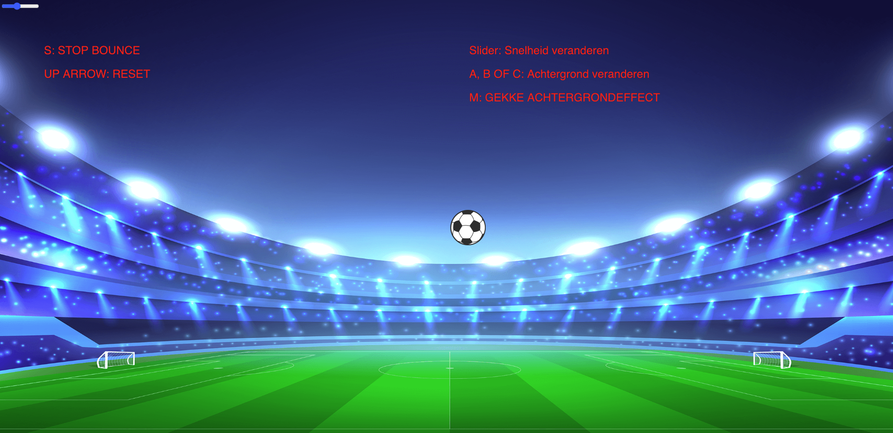

<!-- Vergeet je niet de comments uit te zetten voordat je begint met typen? 💬 -->

# Procesverslag

## Over
* **Naam:** `Thomas Stevens`
* **Klas:** `vid2b`
* **Minor:** `Visual Interface Design`
* **Favoriete dier:** `Katten zijn te gek!`
* **Startniveau:** `Al enige ervaring met HTML/CSS, en ben me wat meer aan het verdiepen in JS`

## Concept 1 (dit is hem geworden)
Ik ben zelf gepassioneerd door voetbal en wou daarom wat met voetbal doen. Mijn idee was om de bal te laten stuiteren op een willekeurige locatie die je zelf kan kiezen, snelheid kunnen aanpassen, maar ook weer op z'n plek leggen. Publiek horen juigen. Kortom: ik wil allemaal features aan de bal toevoegen waardoor het niet statisch blijft.

### Inspiratie
Hobby's
- Sporten (voetbal, darten, tafeltennis)
- UI Interacties bekijken en analyseren (Muzli)
- Ik vindt de natuur + dieren wel tof, Netflix documentaire 'Our Planet'.
- Gamen (Call of Duty)

### Concept 2 (oud)
Championschip Manager / Football Manager concept. In mijn jeugd heb ik namelijk maanden in dit spelletje gespendeerd en het lijkt me daarom heel tof om dit te maken met p5. Het is een voetbalveld van bovenaf (2D), een wedstrijd wordt gespeeld met daarin de spelers + de bal, deze bewegen allemaal en als er gescoord wordt dan komt er geluid bij (denk aan fans die juigen, scoor/feest geluid). Iedere wedstrijd kan anders eindigen, omdat alles af hangt van hoe de spelers presteren.

Input vanuit de gebruiker:
- Gokken wie er gaat winnen van de 2 voetbalteams
- Juichen 
- Fans laten zingen

## Features
- Bal laten stuiteren
- Snelheid van het stuiteren veranderen
- Bal terug zetten op z'n plek
- Locatie veranderen van waar die stuitert

## Onderzoek & inspiratie
Ik heb allereerst inspiratie op gedaan met wat ga ik doen? Ik vond het vrij lastig, maar door middel van een aantal tips kwam ik gelijk terecht bij een hobby van mij. Namelijk voetbal. Je kan hier van alles mee. Los van concept 2 (oude concept), ben ik toch maar gegaan voor de bal waarmee alles kan gebeuren. Ik ben allerlei p5 showcases afgegaan om te kijken wat er allemaal kan gebeuren met een voetbal. 

### Voorbeelden van showcases (inspiratie)
https://editor.p5js.org/Hanyi/sketches/CqbOp7xmI
https://editor.p5js.org/anantanayak9/sketches/-LiiiCn7
https://editor.p5js.org/Normandanny/sketches/HJi-nv6a-

Dit zijn allemaal voetbalvelden maar ik wou daar niks mee doen uiteindelijk. Ik kon creatiever zijn als het alleen om de bal zou draaien. Ik ben dus veel gaan zoeken naar opties in p5 waarin je dingen met de bal kan doen zoals dit:
- https://editor.p5js.org/icm/sketches/BJKWv5Tn (heen en weer)
- https://editor.p5js.org/TeeReggler/sketches/ryqlsjfAb (heen en weer)
- https://editor.p5js.org/ellacyt/sketches/B1lmPZgoZ (stuiteren)

## Voortgang

### Week-1 (31 mei -  4 juni)
Onderzoek en inspiratie gedaan naar een ander concept, vervolgens gefocust op alleen de bal en de p5 showcase doorgekeken naar potentiele elementen die ik kon toepassen in mijn concept. Nu er voor mij eindelijk geen doelloze visie in zat, had ik meteen wat om neer te zetten en heb ik een mooi beginnetje gemaakt. 

### Week-2 (7 juni -  11 juni)
Ik heb me bezig gehouden met het veranderen van de achtergrond en de bal vervangen door een plaatje. Meerdere achtergrond heb ik toegevoegd en nu in de loop naar de volgende week hou ik me meer bezig met de features.  

### Week-3 (14 juni -  20 juni)
Gefocust op nog extra dingetjes zoals audio toevoegen van publiek, tekst toevoegen van de functies (keys) zodat je weet wat alles betekent etc.

## Bronnenlijst
* https://editor.p5js.org/Viv-Galinari/sketches/SJncLkliW
* https://editor.p5js.org/fergfluff/sketches/B1SecD4o-
* https://editor.p5js.org/fergfluff/sketches/H1osPdVob
* https://editor.p5js.org/icm/sketches/BJKWv5Tn
* https://stackoverflow.com/questions/61724523/reset-sketch-in-p5js
* https://editor.p5js.org/fergfluff/sketches/H1osPdVob
* https://p5js.org/reference/#/p5/createSlider
* Lizzy, heeft me voorbeelden gestuurd van hoe zij begon
* Daan, oud klasgenootje
* https://p5js.org/reference/
* https://p5js.org/examples/interaction-wavemaker.html

